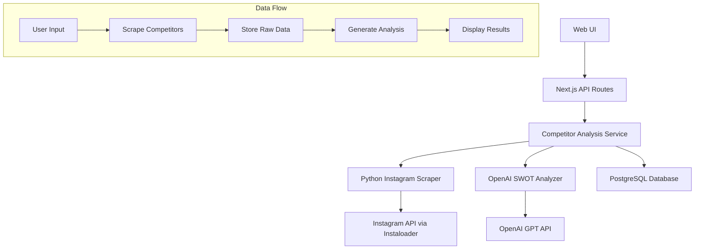

# Competitor Analysis Design Document

## Overview

The Competitor Analysis system is a multi-component architecture that combines Instagram data scraping, AI-powered analysis, and web-based visualization. The system follows a pipeline approach: data collection → processing → analysis → presentation, with robust error handling and rate limiting throughout.

## Architecture

### High-Level Architecture



### Component Architecture

1. **Frontend Layer**: Next.js React components for user interaction
2. **API Layer**: Next.js API routes handling requests and orchestration
3. **Service Layer**: TypeScript services for business logic
4. **Scraping Layer**: Python scripts for Instagram data extraction
5. **AI Layer**: OpenAI integration for SWOT analysis
6. **Data Layer**: PostgreSQL for persistent storage

## Components and Interfaces

### 1. Instagram Scraper Component (Python)

**File**: `scripts/competitor_scraper.py`

**Responsibilities**:
- Extract Instagram profile data using Instaloader
- Analyze recent posts for engagement metrics
- Handle rate limiting and anti-bot measures
- Return structured JSON data

**Key Functions**:
```python
def scrape_competitors(usernames: List[str]) -> Dict
def analyze_recent_posts(loader, profile) -> Dict
def calculate_engagement_rate(profile, recent_posts) -> float
```

**Output Format**:
```json
{
  "competitors": [
    {
      "username": "string",
      "followers": "number",
      "engagement_rate": "number",
      "recent_posts": {
        "avg_likes": "number",
        "content_types": {"video_ratio": "number"}
      }
    }
  ]
}
```

### 2. Competitor Analysis Service (TypeScript)

**File**: `lib/llm/competitor-analysis.ts`

**Responsibilities**:
- Orchestrate competitor data collection
- Interface with OpenAI for SWOT analysis
- Format analysis results for frontend consumption

**Key Interfaces**:
```typescript
interface CompetitorProfile {
  username: string;
  followers: number;
  engagement_rate: number;
  bio: string;
}

interface CompetitorAnalysis {
  swot_analysis: string;
  competitive_positioning: string;
  market_opportunities: string;
  differentiation_strategy: string;
}
```

### 3. Database Schema

**Table**: `competitor_analysis`

```sql
CREATE TABLE competitor_analysis (
  id UUID PRIMARY KEY DEFAULT gen_random_uuid(),
  client_id UUID REFERENCES clients(id),
  competitors_data JSONB,
  swot_analysis TEXT,
  competitive_positioning TEXT,
  market_opportunities TEXT,
  differentiation_strategy TEXT,
  analysis_date TIMESTAMP DEFAULT NOW()
);
```

### 4. API Endpoints

**Primary Endpoint**: `/api/clients/[id]/analysis`
- Handles complete analysis requests
- Orchestrates scraping and AI analysis
- Returns comprehensive results

**Response Structure**:
```json
{
  "competitor_analysis": {
    "competitors": [...],
    "swot_analysis": "string",
    "competitive_positioning": "string"
  }
}
```

### 5. Frontend Components

**Main Component**: Client analysis page with tabs
- Instagram Bio Analysis (existing)
- Competitor Analysis (new tab)
- Integrated results display

## Data Models

### CompetitorProfile Model
```typescript
interface CompetitorProfile {
  username: string;
  full_name?: string;
  followers: number;
  following: number;
  posts: number;
  bio: string;
  is_verified: boolean;
  engagement_rate: number;
  category?: string;
  recent_posts: {
    avg_likes: number;
    avg_comments: number;
    posting_frequency: string;
    content_types: {
      video_ratio: number;
      photo_ratio: number;
    };
  };
}
```

### AnalysisResult Model
```typescript
interface AnalysisResult {
  client_profile: CompetitorProfile;
  competitors: CompetitorProfile[];
  swot_analysis: string;
  competitive_positioning: string;
  market_opportunities: string;
  differentiation_strategy: string;
  analysis_date: Date;
}
```

## Error Handling

### Scraping Error Handling
1. **Rate Limiting**: Implement exponential backoff with jitter
2. **Network Errors**: Retry mechanism with maximum attempts
3. **Profile Not Found**: Continue with remaining competitors
4. **Partial Failures**: Return successful results with error log

### API Error Handling
1. **Scraping Failures**: Return partial results with warnings
2. **AI Analysis Errors**: Fallback to basic competitor comparison
3. **Database Errors**: Log errors, return cached results if available
4. **Timeout Handling**: Set reasonable timeouts for all external calls

### Error Response Format
```json
{
  "success": boolean,
  "data": {...},
  "errors": [
    {
      "type": "scraping_error",
      "competitor": "username",
      "message": "Error description"
    }
  ],
  "warnings": [...]
}
```

## Testing Strategy

### Unit Testing
- **Python Scraper**: Mock Instagram responses, test data parsing
- **TypeScript Services**: Mock external dependencies, test business logic
- **API Routes**: Test request/response handling and error cases

### Integration Testing
- **End-to-End Flow**: Test complete analysis pipeline
- **Database Integration**: Test data persistence and retrieval
- **External API Integration**: Test OpenAI and Instagram API interactions

### Performance Testing
- **Rate Limiting**: Verify scraping respects Instagram limits
- **Concurrent Requests**: Test multiple simultaneous analyses
- **Large Dataset Handling**: Test with many competitors

### Test Data Strategy
- Use mock Instagram profiles for consistent testing
- Create test fixtures for various competitor scenarios
- Mock OpenAI responses for predictable AI analysis testing

## Security Considerations

### Instagram Scraping
- Respect robots.txt and rate limits
- Use appropriate user agents
- Implement session management to avoid detection

### Data Privacy
- Store only necessary competitor data
- Implement data retention policies
- Ensure GDPR compliance for EU users

### API Security
- Validate all input parameters
- Sanitize competitor usernames
- Implement request rate limiting

## Performance Optimization

### Caching Strategy
- Cache competitor profiles for 24 hours
- Cache SWOT analysis results for 7 days
- Implement Redis for fast data retrieval

### Async Processing
- Use background jobs for long-running scraping
- Implement progress tracking for user feedback
- Queue system for handling multiple requests

### Database Optimization
- Index competitor_analysis by client_id and analysis_date
- Use JSONB efficiently for competitor data storage
- Implement database connection pooling